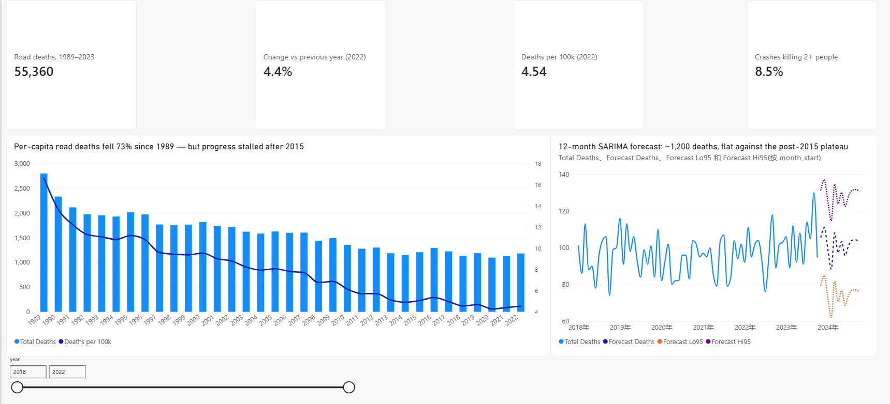
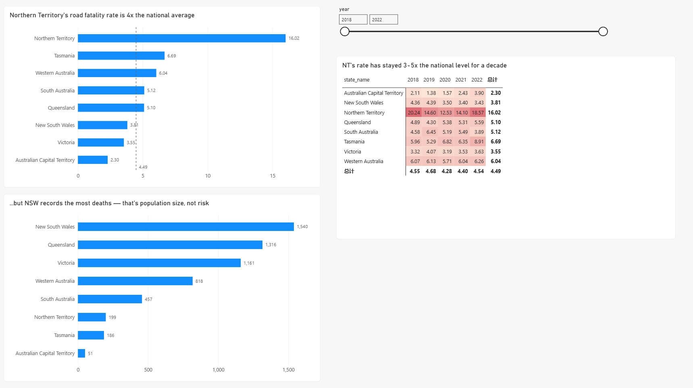
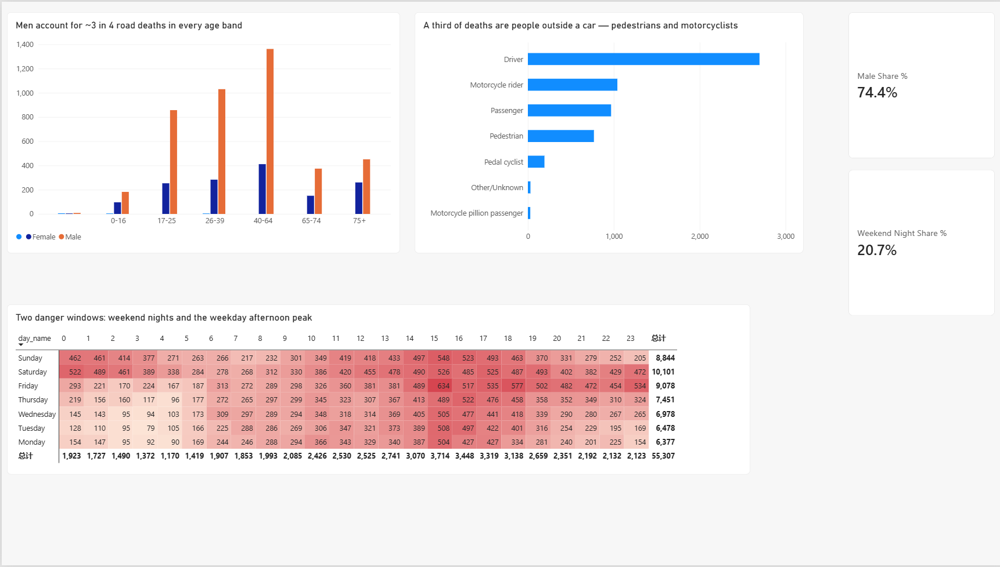
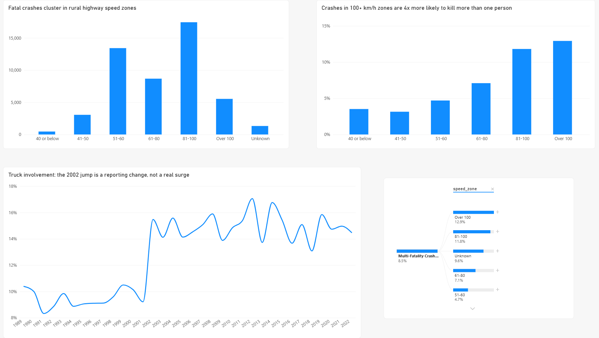
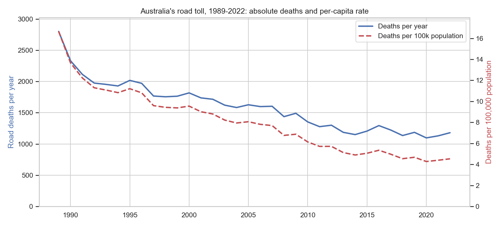
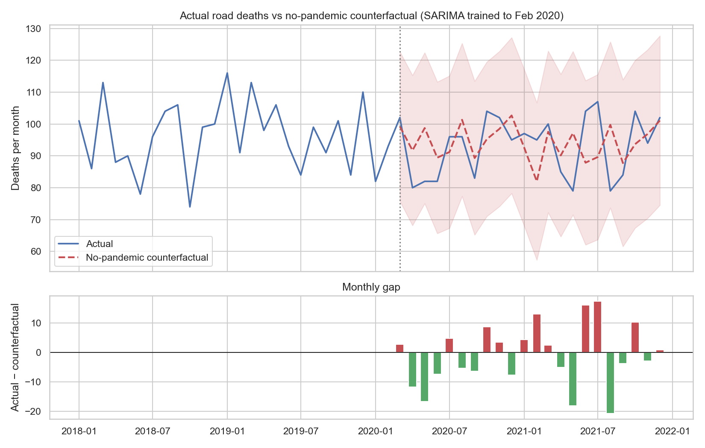

# Australian Road Safety Analysis

[](https://github.com/MQYLEMON/australia-road-safety/actions/workflows/ci.yml)

End-to-end analytics project on 35 years of Australian road fatality data:
**Python data pipeline → SQL analysis layer → statistical modeling → Power BI
dashboard**, built entirely on open government data, with unit-tested cleaning
code under CI.

> **Headline findings**
>
> 1. Australia's per-capita road toll fell **~73%** between 1989 and 2022
>    (16.7 → 4.5 deaths per 100k) — but progress has stalled since ~2015.
> 2. The **Northern Territory's per-capita fatality rate is ~4× the national
>    average**; raw counts (NSW highest) tell the wrong story.
> 3. **Weekend nights** are the deadliest window — but the Christmas period,
>    contrary to folklore, is **no deadlier per day** than the rest of the
>    year. Given a fatal crash *does* happen at Christmas, however, the odds
>    it kills more than one person are **~1.4× higher** (fuller cars).
> 4. COVID lockdowns barely moved the road toll: an interrupted-time-series
>    counterfactual puts the cumulative effect over Mar 2020 – Dec 2021 at
>    **≈ 0 deaths** (−21, 95% range −570 to +530) despite a historic drop in
>    traffic — and the states that locked down hardest were *not* the ones
>    that fell most.
> 5. Crash severity scales with the speed limit: crashes in 100+ km/h zones
>    are **~4x more likely to kill more than one person** than those in 41–50
>    zones (12.9% vs 3.1%).
> 6. A SARIMA model projects **~1,200 deaths** for the 12 months after the
>    data ends (Nov 2023 – Oct 2024), with a calibrated 95% band designed to
>    flag months where the toll drifts above trend.

## The dashboard

[`RoadSafety.pbix`](RoadSafety.pbix) — a four-page Power BI report built on the
star schema this pipeline exports. Assembly steps are in
[powerbi/build_guide.md](powerbi/build_guide.md); every measure is documented in
[powerbi/dax_measures.md](powerbi/dax_measures.md).

**Page 1 — National overview**



KPI cards, the 35-year trend with absolute deaths on one axis and the
per-capita rate on the other, and the SARIMA forecast plotted against actuals
with its 95% band.

**Page 2 — Where the risk actually is**



The two bar charts rank the same eight jurisdictions in almost opposite orders:
the Northern Territory is 1st by per-capita rate and 6th by raw count, New South
Wales the reverse. The dashed reference line is a dynamic measure
(`CALCULATE([Deaths per 100k], ALL(dim_state))`), so it tracks the national rate
for whatever period the slicer selects rather than hard-coding a number that
silently goes stale. The heat matrix shows the NT gap is structural, not a
one-year artefact.

**Page 3 — Who dies, and when**



Men are roughly three in four deaths in every age band. The day × hour matrix
is the page's point: between midnight and 3am, weekend nights average **3.4x
the deaths of weekday nights**, and a second, smaller peak sits in the weekday
afternoon commute. Day-of-week ordering comes from a small `dim_day`
dimension — Power BI rejects sorting a column by one derived from it, so the
sort key has to live in its own table.

**Page 4 — What makes a crash fatal**



Fatal crashes concentrate in 81–100 km/h zones, and severity rises almost
monotonically with the speed limit: the share of crashes killing more than one
person climbs from **3.1% in 41–50 zones to 12.9% above 100 km/h**, a ~4x
gradient that matches the odds ratios from the severity model. The
decomposition tree drills that further by state and crash type.

The truck-involvement line carries a deliberate caveat in its title: the jump
from 9% to 15.5% between 2001 and 2002 is far too abrupt to be a real change in
road use, and reads as a reporting or classification change in the source.



## Project structure

```
├── data/                  (git-ignored; rebuilt by the scripts below)
│   ├── raw/               ARDD + ABS downloads, untouched
│   └── processed/         cleaned tables + Power BI star schema
├── src/
│   ├── download_data.py   fetch ARDD (data.gov.au) + ABS ERP (SDMX API)
│   ├── clean_data.py      cleaning, integrity checks, star-schema export
│   ├── load_to_sqlite.py  load the star schema into SQLite
│   └── run_sql_analysis.py  execute sql/analysis.sql and print results
├── sql/
│   └── analysis.sql       windowed SQL analyses (LAG, rolling frames, RANK, CTEs)
├── notebooks/
│   ├── 01_eda.ipynb       exploratory analysis (executed, with narrative)
│   ├── 02_modeling.ipynb  SARIMA forecast + crash-severity classification
│   └── 03_covid_impact.ipynb  COVID interrupted-time-series counterfactual
├── tests/                 pytest suite for the cleaning pipeline
├── .github/workflows/     CI: ruff lint + unit tests on every push
├── powerbi/
│   ├── build_guide.md     step-by-step dashboard assembly instructions
│   ├── dax_measures.md    full DAX measure library
│   └── screenshots/       dashboard page captures used in this README
├── RoadSafety.pbix        the built two-page Power BI report
└── reports/figures/       publication-ready charts from the notebooks
```

## Reproduce

```bash
pip install -r requirements.txt
python src/download_data.py     # ~12 MB from data.gov.au + ABS API
python src/clean_data.py        # cleaned tables + Power BI star schema
python src/load_to_sqlite.py    # optional: SQLite database for the SQL layer
python src/run_sql_analysis.py  # optional: run the SQL analyses
jupyter notebook notebooks/     # run 01, 02, then 03
pytest tests/                   # unit + integration tests
```

Open [`RoadSafety.pbix`](RoadSafety.pbix) in Power BI Desktop and refresh to
point it at your freshly built tables, or rebuild the report from scratch with
[powerbi/build_guide.md](powerbi/build_guide.md).

## Data engineering

The raw ARDD is realistically messy, and all handling is documented in
[`src/clean_data.py`](src/clean_data.py):

- missing values encoded five different ways (`-9` as int *and* str,
  `Unknown`, `Unspecified`, `U`, blanks) — normalised to a single convention;
- mixed dtypes within one column (`Speed Limit`: `100` and `"100"` and `"<40"`);
- inconsistent category casing (`Arterial Road` vs `ARTERIAL ROAD`) and stray
  whitespace (`"M "` for Male);
- a column name containing an embedded newline, plus a trailing phantom column;
- integrity checks asserted on every run: unique crash IDs, no orphan
  fatalities, fatality counts reconciling between the two files.

The Power BI model is a proper **star schema**: a gapless daily date dimension
(Power BI refuses to mark a month-grain table as a date table, and the DAX
time-intelligence functions assume contiguous days), a state dimension, two
fact tables, and an annual population fact joined via `TREATAS` rather than a
relationship — a year-grain relationship to the date table would silently break
every per-capita measure at month grain. ARDD publishes no day-of-month, so
facts are anchored to their month start. Per-capita rates use ABS 30-June
Estimated Resident Population fetched live from the ABS Data API.

## Testing and CI

The cleaning logic is covered by a [pytest suite](tests/test_clean_data.py) that
runs on synthetic frames (no data download needed) plus integration tests that
skip themselves when `data/` has not been built. GitHub Actions runs `ruff` and
the unit tests on every push.

The tests earn their keep: they caught a real bug in the speed-zone bucketing
where `Series.mask` treats a `pd.NA` comparison result as `False`, silently
filing every unknown speed limit under "40 or below" and inflating that bucket
roughly fourfold.

## SQL layer

`src/load_to_sqlite.py` loads the star schema into SQLite and
[`sql/analysis.sql`](sql/analysis.sql) reproduces the core analyses in SQL —
`LAG` for year-over-year change, a rolling 12-month window frame, `RANK` over a
CTE join for per-capita state rankings, and conditional aggregation for the
road-user and severity breakdowns. Results cross-check against the pandas
figures in the notebooks.

## Modeling

| Model | Task | Result |
|---|---|---|
| SARIMA (0,1,2)(1,1,1)₁₂ | 12-month national fatality forecast | MAPE **13.1%** on a 24-month holdout vs 13.9% seasonal-naive; the near-tie is itself a finding — the post-2015 plateau is close to a seasonal random walk, so the calibrated interval matters more than the point forecast |
| Logistic regression / random forest | P(multi-fatality \| fatal crash) | ROC-AUC **0.70**, PR-AUC 0.18 vs 8.5% base rate; key associations: speed zones >100 km/h (OR 2.8), NT (OR 2.4), 81–100 km/h zones (OR 2.4), Christmas period (OR 1.4) |
| SARIMA counterfactual | COVID interrupted time series | Trained to Feb 2020, projected forward: cumulative effect **−21 deaths** (95% range −570 to +530) over Mar 2020 – Dec 2021 — indistinguishable from zero |

All three notebooks state their caveats explicitly: the severity model measures
*associations among fatal crashes* (no exposure denominator, no occupancy or
restraint data), not causal effects, and the COVID counterfactual cannot
separate "less driving" from "riskier driving" without VKT data.



The counterfactual above is the project's most counter-intuitive result: only
the lockdown-wave months dip meaningfully below the no-pandemic projection, and
the effect washes out entirely across 2020–21. State outcomes did not track
lockdown stringency either — NSW and the ACT fell further than Victoria, while
Queensland and Tasmania *rose* — a reminder that single-year state deltas on
small counts are mostly noise.

## Data sources & licences

| Source | Used for | Licence |
|---|---|---|
| [BITRE Australian Road Deaths Database](https://data.gov.au/data/dataset/australian-road-deaths-database) (data.gov.au) | fatalities & crashes, Jan 1989 – Oct 2023 | CC BY 3.0 AU |
| [ABS Estimated Resident Population](https://www.abs.gov.au/statistics/people/population/national-state-and-territory-population/latest-release) via the [ABS Data API](https://data.api.abs.gov.au) | state populations for per-capita rates | CC BY 4.0 |

BITRE publishes newer monthly extracts on its own site; `download_data.py`
takes a URL swap to use them.

## Limitations

- Crash dates are published at **month grain**; hour-of-day exists but not the
  calendar day, so daily seasonality (long weekends etc.) is approximated via
  BITRE's Christmas/Easter period flags.
- Geographic detail (remoteness, LGA, road type) only exists from ~2021.
- 2023 is a partial year (to October) and recent months are preliminary.
- Fatalities only — no injury or exposure (VKT) data, so no crash-rate
  denominators beyond population.
